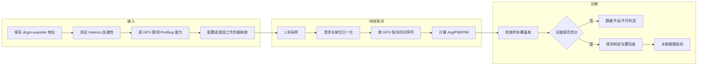
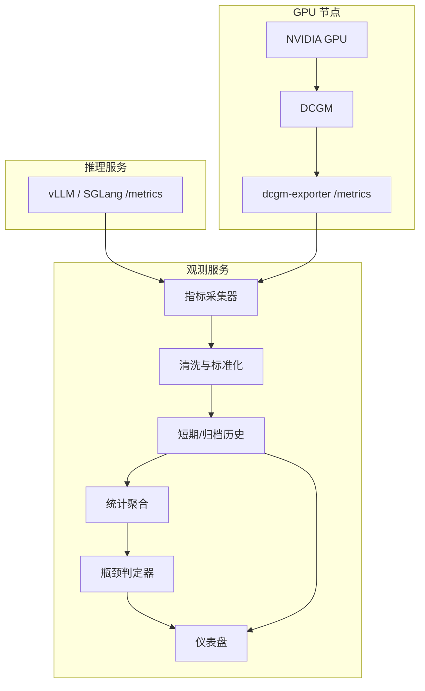

# 大模型推理 GPU Profiling 自动瓶颈判定需求

> 文档状态：需求初稿（待评审）  
> 基线版本：`codex/dcgm-bottleneck-monitoring`，commit `ff1f333`  
> 资料依据：当前仓库实现、`dcgm-exporter-deployment-summary.md`、NVIDIA DCGM Profiling 与 dcgm-exporter 官方文档  
> 适用范围：仅面向 DCGM 官方支持 Profiling 指标的 NVIDIA 数据中心 GPU；不以 GeForce RTX 5090 等非完整 Profiling 支持产品作为验收基线。

## 目录

- [1. 需求概述](#1-需求概述)
- [2. 范围与前置条件](#2-范围与前置条件)
- [3. 用户使用流程](#3-用户使用流程)
- [4. 数据链路与职责](#4-数据链路与职责)
- [5. 指标需求](#5-指标需求)
- [6. 数据处理与统计口径](#6-数据处理与统计口径)
- [7. 自动瓶颈判定](#7-自动瓶颈判定)
- [8. 展示与交互](#8-展示与交互)
- [9. 历史数据与生命周期](#9-历史数据与生命周期)
- [10. 异常与降级](#10-异常与降级)
- [11. 验收标准](#11-验收标准)
- [12. 实施优先级](#12-实施优先级)
- [13. 待确认项](#13-待确认项)

## 1. 需求概述

### 1.1 目标

在现有 vLLM/SGLang 指标观测页面中增加 GPU Profiling 自动诊断能力，将推理服务指标与 GPU 硬件指标放到同一时间轴，自动回答：

- 当前 GPU 是否被持续吃满；
- 当前更倾向于计算受限、显存带宽受限，还是上游供给不足；
- 判断依据是什么，数据是否充分，结论可信度如何；
- 哪张 GPU、哪个时间窗口出现了瓶颈；
- 瓶颈发生时，吞吐、TTFT、TPOT、队列等推理指标如何变化。

系统定位为持续在线观测和初步归因，不替代 Nsight Systems、Nsight Compute 等内核级分析工具。

### 1.2 核心原则

1. **只对支持 Profiling 的 GPU 进行自动判定。** 基础 GPU 指标可用不等于 Profiling 可用。
2. **缺失指标不能按 0 处理。** 未暴露、无权限、采集冲突和真实值为 0 必须区分。
3. **不根据单个采样点下结论。** 判定基于滑动时间窗口和样本覆盖率。
4. **相关性不等于因果。** 页面展示“受限倾向”和证据，不宣称已定位到具体 CUDA kernel。
5. **显存容量与显存带宽分开。** Framebuffer 使用率高不等于 DRAM 带宽受限。
6. **统计口径统一。** 页面聚合只保留 Avg、P90、P99，并明确聚合对象和时间窗口。

### 1.3 非目标

本期不包含：

- 对不支持 DCGM Profiling 的 GPU 使用普通 GPU Util 强行推断瓶颈；
- CUDA kernel、算子或源码行级定位；
- 自动修改 batch、并行度、模型参数或推理引擎配置；
- 仅凭 GPU 指标确定 CPU、网络、调度器中的具体故障点；
- 仅凭 PCIe/NVLink 吞吐自动判定通信瓶颈；
- 建设完整 Prometheus/Grafana 监控平台。

## 2. 范围与前置条件

### 2.1 目标运行环境

- Linux NVIDIA GPU 节点；
- DCGM 与 dcgm-exporter 版本配套；
- 目标 GPU 属于 DCGM 官方支持 Profiling 的产品范围；
- exporter 具备采集 Profiling 硬件计数器所需权限；
- 应用所在机器可以访问 `http(s)://<dcgm-exporter>/metrics`；
- dcgm-exporter 采样周期建议为 1 秒；
- 推理服务为 vLLM 或 SGLang，并能提供服务侧 `/metrics`。

### 2.2 接入门槛

接入时必须先完成能力探测，至少确认：

- DCGM 可以识别目标 GPU；
- `dcgmi profile --list --entity-id gpu:<id>` 返回所需 Profiling 字段；
- exporter `/metrics` 实际暴露所需字段；
- 指标在真实负载下能够持续返回有限数值，而不是空值、`N/A` 或 DCGM sentinel；
- 多卡机器需要逐卡确认，不能只根据 GPU 0 推断全部 GPU；
- 没有其他 Profiling 客户端与 DCGM 争用硬件计数器。

不满足门槛时，页面状态为“Profiling 不兼容”或“Profiling 数据不完整”，不能进入自动判定。

### 2.3 工作负载归属

自动诊断必须知道一组 GPU 属于哪个推理服务、模型和推理引擎。支持以下两种方式：

1. **自动映射：** 通过 Kubernetes Pod/容器标签获得服务、模型和 GPU 归属；
2. **手工映射：** 当 Pod resources 映射不可用时，由用户配置 GPU 集合，例如 `GPU 0-3 -> vLLM/model-A`、`GPU 4-7 -> SGLang/model-B`。

如果只有节点级 GPU 数据而没有工作负载映射，只能给出逐 GPU/节点诊断，不能把结论归属到某个模型或推理引擎。

## 3. 用户使用流程

用户操作顺序：

1. 在“GPU 瓶颈”页面填写 exporter 根地址；
2. 系统保存地址并立即检查连通性与字段能力；
3. 用户确认或配置 GPU 与推理服务的映射；
4. 系统持续采集并展示逐 GPU 曲线；
5. 样本达到最小窗口后开始自动判定；
6. 用户可切换 GPU、服务和时间范围，查看结论、证据及推理指标关联；
7. 用户可断开并删除保存的数据源，删除后停止采集并清理对应内存历史。

## 4. 数据链路与职责

职责边界：

| 组件 | 负责 | 不负责 |
| --- | --- | --- |
| DCGM | 读取设备及 Profiling 硬件计数器 | 推理服务语义、模型归属 |
| dcgm-exporter | 选择字段并暴露 Prometheus 文本 | 保证任意配置字段一定可用 |
| 观测后端 | 拉取、归一化、保存、聚合、诊断 | 伪造缺失指标、替代专业 profiler |
| 前端 | 展示能力、趋势、结论和证据 | 在浏览器端重新定义统计口径 |

## 5. 指标需求

### 5.1 核心 Profiling 指标

以下三项是首版自动判定的核心证据：

| 标准化字段 | DCGM 字段 | 含义 | 用途 |
| --- | --- | --- | --- |
| `sm_active` | `DCGM_FI_PROF_SM_ACTIVE` 或对应新版 ratio 字段 | 采样区间内 SM 活跃比例 | 判断 GPU 是否持续执行工作 |
| `tensor_active` | `DCGM_FI_PROF_PIPE_TENSOR_ACTIVE` 或对应新版 ratio 字段 | Tensor 管线活跃比例 | 判断矩阵计算压力 |
| `dram_active` | `DCGM_FI_PROF_DRAM_ACTIVE` 或对应新版 ratio 字段 | 设备显存接口活跃比例 | 判断显存带宽压力 |

`SM_ACTIVE` 缺失时禁止做计算/显存/低利用率分类。Tensor 或 DRAM 缺失时，只能输出能力允许的部分结论，并降低置信度；不能以缺失值代替低活跃度。

### 5.2 辅助 GPU 指标

| 类别 | 指标 | 作用 |
| --- | --- | --- |
| 通用利用率 | GPU Util、SM Occupancy、GR Engine Active | 辅助判断负载形态，不作为核心 Profiling 的替代值 |
| 显存容量 | FB Used、FB Free | 判断容量压力，与带宽压力分开展示 |
| 功耗与频率 | Power、SM Clock、Memory Clock | 识别功耗墙、降频和性能状态变化 |
| 温度 | GPU Temperature、Memory Temperature | 识别热限制风险 |
| 通信 | PCIe TX/RX、NVLink TX/RX 或总吞吐 | 观察通信流量与多卡差异，不直接判定瓶颈 |
| 健康 | XID、时钟事件/限制原因 | 排除硬件或驱动异常导致的性能下降 |

### 5.3 推理服务关联指标

至少关联：

- 请求吞吐：requests/s；
- Token 吞吐：input tokens/s、output tokens/s、total tokens/s；
- 延迟：TTFT、TPOT/ITL、端到端 latency；
- 调度：running、waiting/queued requests；
- Batch/长度：batch size、accepted length（运行时实际暴露时）；
- KV Cache：usage、hit rate、evictions（运行时有真实语义时）。

延迟和长度等分布型指标只展示 Avg、P90、P99。累计 Counter 必须先转换成区间增量或速率，再参与趋势和相关性分析。

### 5.4 指标语义要求

- 所有 ratio 在后端统一为 `[0, 1]`，前端仅负责格式化为百分比；
- 字节吞吐统一为 bytes/s，前端按 GB/s 展示；
- 显存容量统一为 MiB，前端可转 GiB；
- Profiling 指标是采样区间平均值，不是瞬时值；
- 对同名旧字段和新版 ratio 字段做明确映射，禁止重复计算；
- DCGM 空白值、非有限值、负值和 sentinel 必须过滤并记录为缺失。

## 6. 数据处理与统计口径

### 6.1 采样与对齐

- 默认每 1 秒拉取一次 dcgm-exporter；
- GPU 与推理服务指标使用各自原始时间戳；
- 关联分析按统一时间桶对齐，默认 1 秒；
- 超出允许时间偏差的样本不能强行拼接；
- 服务或 exporter 重启后不得把重启前后的 Counter 直接相减。

### 6.2 统计值

每个选定时间窗口只计算：

- **Avg：** 判断持续压力和整体负载水平；
- **P90：** 判断高负载阶段的常见上界；
- **P99：** 判断尾部尖峰，主要用于延迟、队列、功耗和通信异常。

计算规则：

- Gauge/ratio：直接对有效原始样本计算 Avg、P90、P99；
- Counter：先按相邻有效样本求增量/速率，再计算 Avg、P90、P99；
- 多 GPU 聚合：先按 GPU 独立计算，再做组级汇总，不能把不同 GPU 的原始样本直接混成一个分布；
- 服务级结论必须以已映射的 GPU 集合为边界；
- 页面必须标注时间窗口、有效样本数和数据覆盖率。

### 6.3 诊断窗口

首版建议：

- 实时判定窗口默认 60 秒，可配置；
- 至少 30 个有效样本；
- 核心字段覆盖率至少 80%；
- 窗口内至少 70% 的有效样本满足某类条件，才认为模式稳定；
- 单点峰值只用于异常提示，不改变主瓶颈分类；
- 阈值必须集中配置，后续通过压测基线校准，不能散落在前后端代码中。

以上数值是首版工程默认值，不是 NVIDIA 官方通用阈值。

## 7. 自动瓶颈判定

### 7.1 输出状态

每张 GPU 在每个诊断窗口只能有一个主状态：

| 状态 | 含义 |
| --- | --- |
| `warming_up` | 尚未积累足够样本 |
| `insufficient_data` | Profiling 字段缺失或覆盖率不足 |
| `underutilized` | GPU 未持续获得足够工作 |
| `compute_bound` | 计算管线受限倾向 |
| `memory_bound` | 设备显存带宽受限倾向 |
| `mixed_saturation` | 计算与显存等多类资源同时高压 |
| `thermal_power_limited` | 热、功耗或降频限制倾向 |
| `mixed_or_unknown` | 有负载但证据不足以归入单一瓶颈 |

每个状态必须同时输出：结论、置信度、窗口、证据指标、缺失指标、触发条件和建议排查方向。

### 7.2 首版基础规则

以下阈值沿用当前实现作为初始值，但必须改为窗口判定并支持配置：

| 状态 | 初始条件 | 说明 |
| --- | --- | --- |
| GPU 未吃满 | `SM Active Avg < 50%` | 只能说明 GPU 供给不足；需结合请求量、batch、队列、CPU 与 kernel gap 继续定位 |
| 计算受限倾向 | `SM Active Avg >= 80%`、`Tensor Active Avg >= 65%`、`DRAM Active Avg < 80%` | 适用于以 Tensor 计算为主的模型阶段 |
| 显存带宽受限倾向 | `SM Active Avg >= 80%`、`DRAM Active Avg >= 80%`、`Tensor Active Avg < 65%` | 高 FB Used 不能替代高 DRAM Active |
| 混合饱和 | SM、Tensor、DRAM 的 Avg 均达到高阈值 | 需要结合吞吐变化判断优化收益 |
| 混合/未知 | 不满足以上稳定模式 | 保留证据，不做过度归因 |

### 7.3 通信观测边界

首版不输出“通信瓶颈”自动分类。DCGM 的 PCIe/NVLink 指标只用于展示通信流量和多卡差异，原因是高吞吐既可能代表链路饱和，也可能代表通信工作正常；低吞吐既可能代表通信较少，也可能代表上游已经阻塞。

未来若要启用通信瓶颈判定，至少需要补齐：

- PCIe 或 NVLink 吞吐持续接近该设备/拓扑的有效带宽基线；
- SM Active 出现与通信阶段一致的周期性下降或等待；
- 多 GPU 之间存在明显不均衡，或推理吞吐未随 GPU 数量合理扩展；
- 已知该工作负载使用 TP/PP 等跨卡通信。

没有链路带宽基线、拓扑、工作负载映射和通信阶段证据时，只展示曲线与数值，不输出“通信压力高”或 `communication_bound`。

### 7.4 热/功耗限制

判定至少需要时钟下降与以下证据之一同时出现：

- 功耗接近功率上限或出现 power-cap 事件；
- GPU/显存温度达到设备限制区间或出现 thermal 事件；
- DCGM 暴露明确的时钟限制原因。

只有功耗高或温度高时只能告警，不能直接判定性能受限。

### 7.5 置信度

- **高：** 核心字段完整、覆盖率达标、稳定条件持续满足，且推理指标存在对应退化；
- **中：** GPU 证据完整且模式稳定，但缺少推理指标关联或辅助证据；
- **低：** 只有部分辅助指标或模式不稳定；
- **不可判定：** 核心字段不支持、缺失或样本不足。

## 8. 展示与交互

### 8.1 数据源管理

- 支持填写 exporter 根地址或带 `/metrics` 的地址，并统一标准化；
- 支持保存数据源，下次启动自动恢复；
- 支持“断开并删除”，删除前二次确认；
- 删除后停止采集，并清理该数据源在当前进程中的历史；
- 展示最后采集时间、GPU 数量、错误原因和 Profiling 能力状态。

### 8.2 总览

总览按已选择的服务/GPU 组展示：

- GPU 数量；
- 当前主瓶颈及置信度；
- 各瓶颈状态的 GPU 数量；
- 核心指标的 Avg/P90/P99；
- 数据覆盖率与缺失字段。

跨 GPU 汇总必须标注聚合方式。总和只适用于功耗、吞吐等可加指标；利用率必须使用平均或分位数，不能相加。

### 8.3 逐 GPU 页面

每张 GPU 展示：

- GPU ID、UUID、型号、主机及工作负载归属；
- 当前诊断、置信度和文字原因；
- SM、Tensor、DRAM、GPU Util 证据条；
- 核心活跃度、显存、功耗、PCIe/NVLink、频率、温度历史曲线；
- 同时间轴的吞吐、TTFT、TPOT、请求队列曲线；
- 缺失指标和能力限制说明。

### 8.4 时间范围

支持：最近 5 分钟、15 分钟、30 分钟、1 小时、3 小时、6 小时、12 小时、24 小时、2 天。

长时间范围使用降采样数据，但 Avg/P90/P99 必须基于正确的桶统计；不能对已经求过的 P90/P99 再简单求分位数。

## 9. 历史数据与生命周期

### 9.1 首版保留策略

- 近期数据保留 1 秒粒度；
- 长期数据按 30 秒桶归档；
- 最长查看 48 小时；
- TTL 到期自动清理；
- 数据源删除时立即清理其历史数据。

### 9.2 持久化边界

当前分支采用进程内历史，服务重启后历史会丢失。需求分两阶段：

- **MVP：** 保证服务持续运行期间可以查看最近 48 小时；
- **增强版：** 接入本地持久化或 Prometheus/VictoriaMetrics，重启后仍能恢复历史。

前端不能声称“已永久保存”；必须明确显示实际保留时长和数据来源。

## 10. 异常与降级

| 场景 | 处理要求 |
| --- | --- |
| exporter 不可达 | 保留数据源配置，显示错误；不得用旧值冒充当前值 |
| Profiling 不支持 | 显示不兼容，不进入判定 |
| 仅部分 GPU 缺字段 | 逐 GPU 降级，不能用其他 GPU 的能力代替 |
| 核心字段缺失 | 输出 `insufficient_data`，列出字段及排查方向 |
| DCGM sentinel/NaN/负值 | 丢弃样本并计入缺失率 |
| 采样中断 | 曲线保留空洞，不做插值伪造负载 |
| Counter 重置 | 从重置点重新计算增量，禁止产生巨大负速率或尖峰 |
| 指标组冲突 | 提示 Profiling 资源冲突，避免错误归零 |
| 工作负载映射缺失 | 仅输出逐 GPU/节点结论，不归属模型 |
| 多卡指标不均衡 | 单独提示 straggler/负载不均衡，不用组平均掩盖异常 GPU |

## 11. 验收标准

### 11.1 能力与采集

- [ ] 在官方支持 Profiling 的测试 GPU 上逐卡完成能力识别；
- [ ] 正确采集并归一化 SM Active、Tensor Active、DRAM Active；
- [ ] 配置字段但运行时未返回时，页面显示缺失而不是 0%；
- [ ] 1 秒采样连续运行 30 分钟，无无界内存增长；
- [ ] exporter 中断和恢复后能够自动恢复采集；
- [ ] 多 GPU 的指标、UUID 和历史不会串卡。

### 11.2 统计准确性

- [ ] Avg、P90、P99 与离线使用相同原始样本计算的结果一致；
- [ ] Counter 重置不会生成错误尖峰；
- [ ] 缺失样本不会被补 0；
- [ ] 跨 GPU 的利用率不做求和；
- [ ] 长窗口降采样后仍保留正确统计语义；
- [ ] 页面展示有效样本数与覆盖率。

### 11.3 诊断准确性

- [ ] 未达到最小样本数时显示 `warming_up`；
- [ ] 缺少 SM Active 时只能显示 `insufficient_data`；
- [ ] 使用可控压测分别构造低利用、计算高压、显存带宽高压场景，并命中预期分类；
- [ ] 短时单点尖峰不会改变主诊断；
- [ ] 多卡中单卡异常不会被组平均隐藏；
- [ ] 热/功耗结论必须满足组合证据要求；通信指标不参与首版自动分类；
- [ ] 每个结论可以追溯到时间窗口、阈值和原始指标。

### 11.4 交互

- [ ] 支持保存、恢复、断开并删除 DCGM 数据源；
- [ ] 支持选择服务/GPU 组和单张 GPU；
- [ ] 支持 5 分钟至 2 天时间范围；
- [ ] GPU 与推理指标能够在同一时间轴查看；
- [ ] 不兼容、无数据、采集中、正常和异常状态文案清晰可区分。

## 12. 实施优先级

### P0：准确采集与保守判定

- Profiling 能力探测与逐 GPU 字段状态；
- SM/Tensor/DRAM 正确采集、归一化和缺失处理；
- 基于滑动窗口的稳定性判定；
- Avg/P90/P99 统一统计；
- 数据源保存/删除与 48 小时 TTL；
- 逐 GPU 曲线和诊断证据。

### P1：推理指标关联与多卡分析

- GPU 与服务/模型/引擎映射；
- GPU 指标与吞吐、TTFT、TPOT、队列同轴展示；
- GPU 间负载不均衡与 straggler 提示；
- PCIe/NVLink 通信趋势与多卡差异展示，不做自动瓶颈分类。

### P2：高级限制与持久化

- 热限制、功耗墙和时钟限制原因；
- 持久化历史或接入 Prometheus/VictoriaMetrics；
- 基于不同 GPU 型号、模型和推理阶段校准阈值；
- 补齐链路基线、拓扑和 NCCL/通信阶段证据后，再评估通信瓶颈分类；
- 诊断事件列表、导出和对比分析。

## 13. 待确认项

1. 首个正式验收使用哪一款支持 Profiling 的 GPU；
2. 工作负载映射采用 Kubernetes 自动标签还是手工 GPU 分组；
3. 实时判定窗口是否采用默认 60 秒，是否需要同时支持 5 分钟稳定结论；
4. 通信带宽基线来自理论规格还是首次压测自动标定；
5. 48 小时历史是否必须跨服务重启保留；
6. 首版是否需要直接输出优化建议，还是只输出瓶颈类型与证据；
7. 阈值是全局配置，还是按 GPU 型号/模型/推理引擎分别配置。

## 快速回忆

- 先做 Profiling 能力探测，再做自动判定；不支持就明确降级。
- 主判断依赖 SM、Tensor、DRAM 三类区间活跃度，缺失不能当 0。
- 使用时间窗口、覆盖率和稳定比例，禁止单点判定。
- 统计只保留 Avg、P90、P99；Counter 必须先转增量或速率。
- GPU 结论必须与具体 GPU/服务映射绑定，多卡平均不能掩盖异常卡。
- 输出“瓶颈倾向 + 置信度 + 证据”，内核级归因仍交给 Nsight。

## 参考资料

- [NVIDIA DCGM Profiling](https://docs.nvidia.com/datacenter/dcgm/latest/learn/modules/profiling.html)
- [NVIDIA DCGM Exporter Metrics](https://docs.nvidia.com/datacenter/dcgm/latest/reference/dcgm-exporter-metrics.html)
- [NVIDIA DCGM Supported Platforms](https://docs.nvidia.com/datacenter/dcgm/latest/user-guide/getting-started.html)
